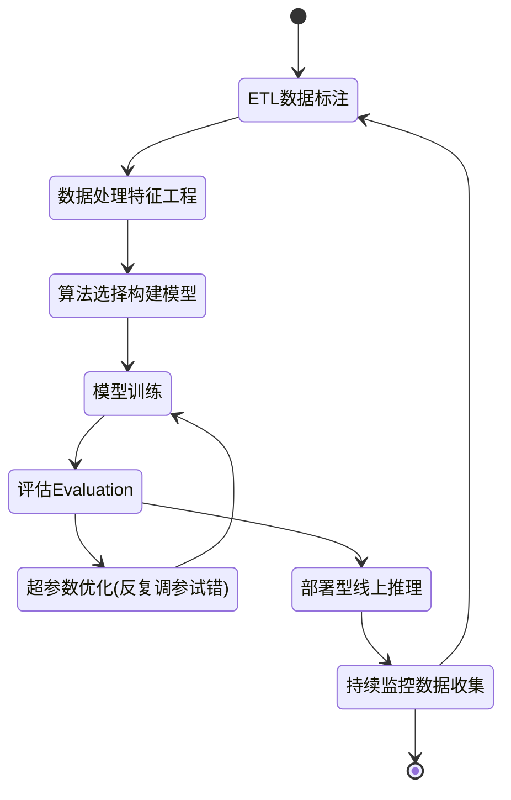

# 使用SageMaker+XGBoost，将时间序列转换为监督学习，完成预测性维护的实践

**关键字**：SageMaker；XGBoost；Python；滑窗；滑动窗口方法；时间序列预测转化为监督学习问题；将多元时间序列数据转换为监督学习问题；如何用Python将时间序列问题转化为有监督学习问题；时间序列预测的机器学习模型；

[TOC]

```toc
目录 
一、前言
二、需求分析与预测结果
三、数据处理与特征工程
四、SageMaker+XGBoost 训练与朝参数调优
五、模型部署与使用
六、结论
七、引用
```


## 一、前言

**《预测性维护》是传统制造业常见AI场景。过去多年，制造业一直在努力提高运营效率，并避免由于组件故障而导致停机。通常使用的方法是：**

1. 通常采用的方法是使用“物理传感器（标签）”做数据连接，存储和大屏上进行了大量重复投资，以监视设备状况并获得实时警报。
2. 主要的数据分析方法是单变量阈值和基于物理的建模方法，尽管这些方法在检测特定故障类型和操作条件方面很有效，但它们通常会错过通过推导每台设备的多元关系而检测到的重要信息。
3. 借助机器学习，可以提供从设备的历史数据中学习的数据驱动模型。主要挑战在于，ML的项目投资和工程师培训，实施这样的机器学习解决方案既耗时又昂贵。


**AWS Sagemaker提供了一个简单有效的解决方案，就是使用Sagemaker+XGboost完成检测到异常的设备行为，实现《预测性维护》的场景需求。**

1. 使用了“**滑窗**”方法进行数据集的重构，并配合XGBoost算法，**将多元时间序列数据集转换为监督学习问题（复杂问题转换为简单问题）；**
2. 使用Sagemaker Studio各项功能（自动机器学习Autopilot、自动化的调参 Hyperparameter tuning jobs、多模型终端节点multi-model endpoints等）**加速XGBoost超参数优化的速度，有效提高模型准确度**；
3. 使用Sagemaker Studio **完成数据预处理与特征工程**：1）探索相关性；2）缩小特征值范围；3）将海量数据分为几批进行预处理，以避免服务器内存溢出；4）数据清理，滑动窗口清除无效数据；5）过滤数据，解决正负样本不平衡的问题；
4. 使用Sagemaker+XGboost训练了6个预测模型，分别覆盖提前5、10、20、30、40、50分钟，演示实验结果。


**首先您需要关注的是ML工作流程，是如何使用Amazon SageMaker和XGBoost完成典型ML工作流程中的每个步骤。 在此过程中，您将看到Amazon SageMaker如何使用各种功能来提高ML的效率并同时降低成本。**

##### SageMaker + XGBoost的机器学习生命周期



![](https://mermaid.ink/img/eyJjb2RlIjoic3RhdGVEaWFncmFtLXYyXG4gICAgWypdIC0tPiBFVEzmlbDmja7moIfms6hcbiAgICBFVEzmlbDmja7moIfms6ggLS0-IOaVsOaNruWkhOeQhueJueW-geW3peeoiyAgICAgIFxuICAgIOaVsOaNruWkhOeQhueJueW-geW3peeoiyAtLT4g566X5rOV6YCJ5oup5p6E5bu65qih5Z6LXG4gICAg566X5rOV6YCJ5oup5p6E5bu65qih5Z6LIC0tPiDmqKHlnovorq3nu4NcbiAgICDmqKHlnovorq3nu4MgLS0-IOivhOS8sEV2YWx1YXRpb25cbiAgICDor4TkvLBFdmFsdWF0aW9uIC0tPui2heWPguaVsOS8mOWMlijlj43lpI3osIPlj4Lor5XplJkpXG4gICAg6LaF5Y-C5pWw5LyY5YyWKOWPjeWkjeiwg-WPguivlemUmSkgLS0-IOaooeWei-iuree7g1xuICAgIOivhOS8sEV2YWx1YXRpb24gLS0-IOmDqOe9suWei-e6v-S4iuaOqOeQhlxuICAgIOmDqOe9suWei-e6v-S4iuaOqOeQhiAtLT4g5oyB57ut55uR5o6n5pWw5o2u5pS26ZuGICAgIFxuICAgIOaMgee7reebkeaOp-aVsOaNruaUtumbhiAtLT4gRVRM5pWw5o2u5qCH5rOoXG4gICAg5oyB57ut55uR5o6n5pWw5o2u5pS26ZuGIC0tPiBbKl0iLCJtZXJtYWlkIjp7InRoZW1lIjoiZGVmYXVsdCIsInRoZW1lVmFyaWFibGVzIjp7ImJhY2tncm91bmQiOiJ3aGl0ZSIsInByaW1hcnlDb2xvciI6IiNFQ0VDRkYiLCJzZWNvbmRhcnlDb2xvciI6IiNmZmZmZGUiLCJ0ZXJ0aWFyeUNvbG9yIjoiaHNsKDgwLCAxMDAlLCA5Ni4yNzQ1MDk4MDM5JSkiLCJwcmltYXJ5Qm9yZGVyQ29sb3IiOiJoc2woMjQwLCA2MCUsIDg2LjI3NDUwOTgwMzklKSIsInNlY29uZGFyeUJvcmRlckNvbG9yIjoiaHNsKDYwLCA2MCUsIDgzLjUyOTQxMTc2NDclKSIsInRlcnRpYXJ5Qm9yZGVyQ29sb3IiOiJoc2woODAsIDYwJSwgODYuMjc0NTA5ODAzOSUpIiwicHJpbWFyeVRleHRDb2xvciI6IiMxMzEzMDAiLCJzZWNvbmRhcnlUZXh0Q29sb3IiOiIjMDAwMDIxIiwidGVydGlhcnlUZXh0Q29sb3IiOiJyZ2IoOS41MDAwMDAwMDAxLCA5LjUwMDAwMDAwMDEsIDkuNTAwMDAwMDAwMSkiLCJsaW5lQ29sb3IiOiIjMzMzMzMzIiwidGV4dENvbG9yIjoiIzMzMyIsIm1haW5Ca2ciOiIjRUNFQ0ZGIiwic2Vjb25kQmtnIjoiI2ZmZmZkZSIsImJvcmRlcjEiOiIjOTM3MERCIiwiYm9yZGVyMiI6IiNhYWFhMzMiLCJhcnJvd2hlYWRDb2xvciI6IiMzMzMzMzMiLCJmb250RmFtaWx5IjoiXCJ0cmVidWNoZXQgbXNcIiwgdmVyZGFuYSwgYXJpYWwiLCJmb250U2l6ZSI6IjE2cHgiLCJsYWJlbEJhY2tncm91bmQiOiIjZThlOGU4Iiwibm9kZUJrZyI6IiNFQ0VDRkYiLCJub2RlQm9yZGVyIjoiIzkzNzBEQiIsImNsdXN0ZXJCa2ciOiIjZmZmZmRlIiwiY2x1c3RlckJvcmRlciI6IiNhYWFhMzMiLCJkZWZhdWx0TGlua0NvbG9yIjoiIzMzMzMzMyIsInRpdGxlQ29sb3IiOiIjMzMzIiwiZWRnZUxhYmVsQmFja2dyb3VuZCI6IiNlOGU4ZTgiLCJhY3RvckJvcmRlciI6ImhzbCgyNTkuNjI2MTY4MjI0MywgNTkuNzc2NTM2MzEyOCUsIDg3LjkwMTk2MDc4NDMlKSIsImFjdG9yQmtnIjoiI0VDRUNGRiIsImFjdG9yVGV4dENvbG9yIjoiYmxhY2siLCJhY3RvckxpbmVDb2xvciI6ImdyZXkiLCJzaWduYWxDb2xvciI6IiMzMzMiLCJzaWduYWxUZXh0Q29sb3IiOiIjMzMzIiwibGFiZWxCb3hCa2dDb2xvciI6IiNFQ0VDRkYiLCJsYWJlbEJveEJvcmRlckNvbG9yIjoiaHNsKDI1OS42MjYxNjgyMjQzLCA1OS43NzY1MzYzMTI4JSwgODcuOTAxOTYwNzg0MyUpIiwibGFiZWxUZXh0Q29sb3IiOiJibGFjayIsImxvb3BUZXh0Q29sb3IiOiJibGFjayIsIm5vdGVCb3JkZXJDb2xvciI6IiNhYWFhMzMiLCJub3RlQmtnQ29sb3IiOiIjZmZmNWFkIiwibm90ZVRleHRDb2xvciI6ImJsYWNrIiwiYWN0aXZhdGlvbkJvcmRlckNvbG9yIjoiIzY2NiIsImFjdGl2YXRpb25Ca2dDb2xvciI6IiNmNGY0ZjQiLCJzZXF1ZW5jZU51bWJlckNvbG9yIjoid2hpdGUiLCJzZWN0aW9uQmtnQ29sb3IiOiJyZ2JhKDEwMiwgMTAyLCAyNTUsIDAuNDkpIiwiYWx0U2VjdGlvbkJrZ0NvbG9yIjoid2hpdGUiLCJzZWN0aW9uQmtnQ29sb3IyIjoiI2ZmZjQwMCIsInRhc2tCb3JkZXJDb2xvciI6IiM1MzRmYmMiLCJ0YXNrQmtnQ29sb3IiOiIjOGE5MGRkIiwidGFza1RleHRMaWdodENvbG9yIjoid2hpdGUiLCJ0YXNrVGV4dENvbG9yIjoid2hpdGUiLCJ0YXNrVGV4dERhcmtDb2xvciI6ImJsYWNrIiwidGFza1RleHRPdXRzaWRlQ29sb3IiOiJibGFjayIsInRhc2tUZXh0Q2xpY2thYmxlQ29sb3IiOiIjMDAzMTYzIiwiYWN0aXZlVGFza0JvcmRlckNvbG9yIjoiIzUzNGZiYyIsImFjdGl2ZVRhc2tCa2dDb2xvciI6IiNiZmM3ZmYiLCJncmlkQ29sb3IiOiJsaWdodGdyZXkiLCJkb25lVGFza0JrZ0NvbG9yIjoibGlnaHRncmV5IiwiZG9uZVRhc2tCb3JkZXJDb2xvciI6ImdyZXkiLCJjcml0Qm9yZGVyQ29sb3IiOiIjZmY4ODg4IiwiY3JpdEJrZ0NvbG9yIjoicmVkIiwidG9kYXlMaW5lQ29sb3IiOiJyZWQiLCJsYWJlbENvbG9yIjoiYmxhY2siLCJlcnJvckJrZ0NvbG9yIjoiIzU1MjIyMiIsImVycm9yVGV4dENvbG9yIjoiIzU1MjIyMiIsImNsYXNzVGV4dCI6IiMxMzEzMDAiLCJmaWxsVHlwZTAiOiIjRUNFQ0ZGIiwiZmlsbFR5cGUxIjoiI2ZmZmZkZSIsImZpbGxUeXBlMiI6ImhzbCgzMDQsIDEwMCUsIDk2LjI3NDUwOTgwMzklKSIsImZpbGxUeXBlMyI6ImhzbCgxMjQsIDEwMCUsIDkzLjUyOTQxMTc2NDclKSIsImZpbGxUeXBlNCI6ImhzbCgxNzYsIDEwMCUsIDk2LjI3NDUwOTgwMzklKSIsImZpbGxUeXBlNSI6ImhzbCgtNCwgMTAwJSwgOTMuNTI5NDExNzY0NyUpIiwiZmlsbFR5cGU2IjoiaHNsKDgsIDEwMCUsIDk2LjI3NDUwOTgwMzklKSIsImZpbGxUeXBlNyI6ImhzbCgxODgsIDEwMCUsIDkzLjUyOTQxMTc2NDclKSJ9fSwidXBkYXRlRWRpdG9yIjpmYWxzZX0)


## 二、需求分析与预测结果

实验数据信息如下


索取实验数据，请[点击](mail:me@liangyiming.com)这里。


## 三、数据处理与特征工程

ETL数据标注
数据处理
特征工程


## 四、SageMaker+XGBoost 训练与朝参数调优

算法选择构建模型
模型训练
超参数优化(反复调参试错)
评估Evaluation


## 五、模型部署与使用

部署模型线上推理
持续监控数据收集

## 六、结论


## 七、引用

引用reference：

1. 机器学习中梯度提升算法的简要介绍 https://machinelearningmastery.com/gentle-introduction-gradient-boosting-algorithm-machine-learning/
2. 时间序列预测转化为监督学习问题 https://machinelearningmastery.com/time-series-forecasting-supervised-learning/
3. 如何用Python将时间序列问题转化为有监督学习问题 https://machinelearningmastery.com/convert-time-series-supervised-learning-problem-python/
4. How To Backtest Machine Learning Models for Time Series Forecasting如何回测时间序列预测的机器学习模型 https://machinelearningmastery.com/backtest-machine-learning-models-time-series-forecasting/
5. How to Use XGBoost for Time Series Forecasting https://machinelearningmastery.com/xgboost-for-time-series-forecasting/


---

