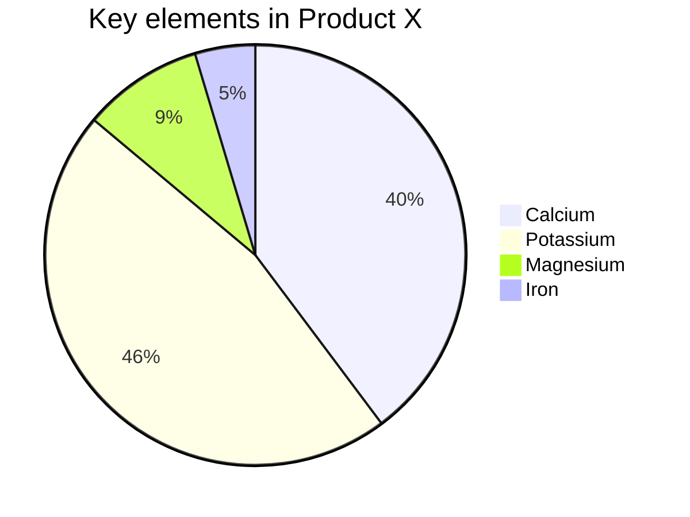

### 如何一次导出多个AWS账号下的资源使用清单？
> https://github.com/liangyimingcom/How-to-export-resource-usage-list-under-multiple-AWS-accounts-at-once

### 适用小白用户的 AWS S3 上传下载工具 - 配置与使用指南(AWS中国区测试可用)
> https://github.com/liangyimingcom/AWS-S3-upload-and-download-tool-configuration-and-usage-guide_available-for-AWS-China





```flow
a=>start: 闹钟响起
b=>operation: 与床板分离
c=>condition: 分离成功?aadd
d=>condition1: 分离成功?aa
f=>condition2: 分离成功?aa
x=>end: 快乐的一天

a->b->c->d->f
c(yes)->x
c(no)->x
```

