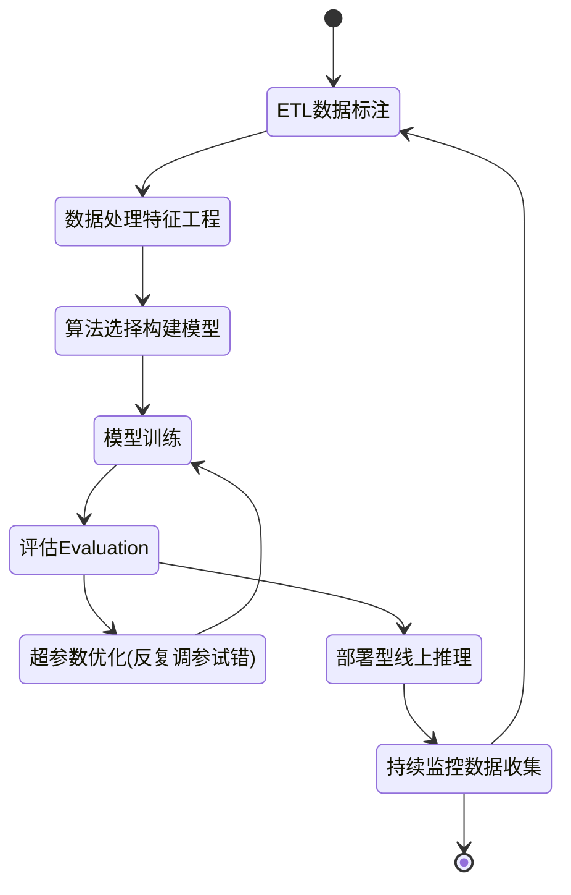

# 使用SageMaker+XGBoost，将时间序列转换为监督学习，完成预测性维护的实践

**关键字**：SageMaker；XGBoost；Python；滑窗；滑动窗口方法；时间序列预测转化为监督学习问题；将多元时间序列数据转换为监督学习问题；如何用Python将时间序列问题转化为有监督学习问题；时间序列预测的机器学习模型；Machine Learning；ML；

[TOC]

```toc
目录 
一、前言
二、需求分析与预测结果
    1）预测维护的实验数据集
    2）预测维护需求说明
    3）特征工程
    4）使用“滑窗”方法，将特征工程后的时间序列数据集
    5）预测结果
三、滑动窗口原理解析
    时间序列问题的类型
    实验数据集的类型：
    使用滑动窗口方法转换数据
    滑动窗口方法在实验数据集的验证结果：
四、数据预处理与特征工程
    滑动窗口的代码实现
    数据预处理
    样本不均衡处理
    数据标注与特征工程
五、SageMaker+XGBoost 训练与超参数调优
    什么是XGBoost？
    算法选择构建模型
    模型训练
    超参数优化(反复调参试错)
    评估Evaluation 与 模型推理
六、模型部署与使用
    部署模型线上推理
    模型评估 与 模型推理（预测效果展示）
七、结论
八、引用reference
```


## 一、前言

**《预测性维护》是传统制造业常见AI场景。过去多年，制造业一直在努力提高运营效率，并避免由于组件故障而导致停机。通常使用的方法是：**

1. 通常采用的方法是使用“物理传感器（标签）”做数据连接，存储和大屏上进行了大量重复投资，以监视设备状况并获得实时警报。
2. 主要的数据分析方法是单变量阈值和基于物理的建模方法，尽管这些方法在检测特定故障类型和操作条件方面很有效，但它们通常会错过"通过推导每台设备的多元关系"而检测到的重要信息。
3. 借助机器学习，可以提供从设备的历史数据中学习的数据驱动模型。主要挑战在于，Machine Learning(ML)的项目投资和工程师培训，实施这样的机器学习解决方案既耗时又昂贵。

  

**AWS Sagemaker提供了一个简单有效的解决方案，就是使用Sagemaker+XGboost完成检测到异常的设备行为，实现《预测性维护》的场景需求**，本文内容覆盖了：

1. 使用了“**滑窗**”方法进行数据集的重构，并配合XGBoost算法，**将多元时间序列数据集转换为监督学习问题（复杂问题转换为简单问题）；**
2. 使用Sagemaker Studio各项功能（自动机器学习Autopilot、自动化的调参 Hyperparameter tuning jobs、多模型终端节点multi-model endpoints等）**加速XGBoost超参数优化的速度，有效提高模型准确度，并大幅降低日程推理成本**；
3. 使用Sagemaker Studio **完成数据预处理与特征工程**：
   - [ ] 1）探索相关性；
   - [ ] 2）缩小特征值范围；
   - [ ] 3）将海量数据分为几批进行预处理，以避免服务器内存溢出；
   - [ ] 4）数据清理，滑动窗口清除无效数据；
   - [ ] 5）过滤数据，解决正负样本不平衡的问题；
4. 针对实验数据，使用Sagemaker+XGboost训练了6个预测模型，分别覆盖提前5、10、20、30、40、50分钟进行预测，演示预测结果结果。


**首先您需要关注的是ML工作流程。即如何使用Amazon SageMaker和XGBoost完成典型ML工作流程中的每个步骤。 在此过程中，您将看到Amazon SageMaker如何使用各种功能来提高ML的效率并同时降低成本。**

 **SageMaker + XGBoost的机器学习生命周期**



![](https://mermaid.ink/img/eyJjb2RlIjoic3RhdGVEaWFncmFtLXYyXG4gICAgWypdIC0tPiBFVEzmlbDmja7moIfms6hcbiAgICBFVEzmlbDmja7moIfms6ggLS0-IOaVsOaNruWkhOeQhueJueW-geW3peeoiyAgICAgIFxuICAgIOaVsOaNruWkhOeQhueJueW-geW3peeoiyAtLT4g566X5rOV6YCJ5oup5p6E5bu65qih5Z6LXG4gICAg566X5rOV6YCJ5oup5p6E5bu65qih5Z6LIC0tPiDmqKHlnovorq3nu4NcbiAgICDmqKHlnovorq3nu4MgLS0-IOivhOS8sEV2YWx1YXRpb25cbiAgICDor4TkvLBFdmFsdWF0aW9uIC0tPui2heWPguaVsOS8mOWMlijlj43lpI3osIPlj4Lor5XplJkpXG4gICAg6LaF5Y-C5pWw5LyY5YyWKOWPjeWkjeiwg-WPguivlemUmSkgLS0-IOaooeWei-iuree7g1xuICAgIOivhOS8sEV2YWx1YXRpb24gLS0-IOmDqOe9suWei-e6v-S4iuaOqOeQhlxuICAgIOmDqOe9suWei-e6v-S4iuaOqOeQhiAtLT4g5oyB57ut55uR5o6n5pWw5o2u5pS26ZuGICAgIFxuICAgIOaMgee7reebkeaOp-aVsOaNruaUtumbhiAtLT4gRVRM5pWw5o2u5qCH5rOoXG4gICAg5oyB57ut55uR5o6n5pWw5o2u5pS26ZuGIC0tPiBbKl0iLCJtZXJtYWlkIjp7InRoZW1lIjoiZGVmYXVsdCIsInRoZW1lVmFyaWFibGVzIjp7ImJhY2tncm91bmQiOiJ3aGl0ZSIsInByaW1hcnlDb2xvciI6IiNFQ0VDRkYiLCJzZWNvbmRhcnlDb2xvciI6IiNmZmZmZGUiLCJ0ZXJ0aWFyeUNvbG9yIjoiaHNsKDgwLCAxMDAlLCA5Ni4yNzQ1MDk4MDM5JSkiLCJwcmltYXJ5Qm9yZGVyQ29sb3IiOiJoc2woMjQwLCA2MCUsIDg2LjI3NDUwOTgwMzklKSIsInNlY29uZGFyeUJvcmRlckNvbG9yIjoiaHNsKDYwLCA2MCUsIDgzLjUyOTQxMTc2NDclKSIsInRlcnRpYXJ5Qm9yZGVyQ29sb3IiOiJoc2woODAsIDYwJSwgODYuMjc0NTA5ODAzOSUpIiwicHJpbWFyeVRleHRDb2xvciI6IiMxMzEzMDAiLCJzZWNvbmRhcnlUZXh0Q29sb3IiOiIjMDAwMDIxIiwidGVydGlhcnlUZXh0Q29sb3IiOiJyZ2IoOS41MDAwMDAwMDAxLCA5LjUwMDAwMDAwMDEsIDkuNTAwMDAwMDAwMSkiLCJsaW5lQ29sb3IiOiIjMzMzMzMzIiwidGV4dENvbG9yIjoiIzMzMyIsIm1haW5Ca2ciOiIjRUNFQ0ZGIiwic2Vjb25kQmtnIjoiI2ZmZmZkZSIsImJvcmRlcjEiOiIjOTM3MERCIiwiYm9yZGVyMiI6IiNhYWFhMzMiLCJhcnJvd2hlYWRDb2xvciI6IiMzMzMzMzMiLCJmb250RmFtaWx5IjoiXCJ0cmVidWNoZXQgbXNcIiwgdmVyZGFuYSwgYXJpYWwiLCJmb250U2l6ZSI6IjE2cHgiLCJsYWJlbEJhY2tncm91bmQiOiIjZThlOGU4Iiwibm9kZUJrZyI6IiNFQ0VDRkYiLCJub2RlQm9yZGVyIjoiIzkzNzBEQiIsImNsdXN0ZXJCa2ciOiIjZmZmZmRlIiwiY2x1c3RlckJvcmRlciI6IiNhYWFhMzMiLCJkZWZhdWx0TGlua0NvbG9yIjoiIzMzMzMzMyIsInRpdGxlQ29sb3IiOiIjMzMzIiwiZWRnZUxhYmVsQmFja2dyb3VuZCI6IiNlOGU4ZTgiLCJhY3RvckJvcmRlciI6ImhzbCgyNTkuNjI2MTY4MjI0MywgNTkuNzc2NTM2MzEyOCUsIDg3LjkwMTk2MDc4NDMlKSIsImFjdG9yQmtnIjoiI0VDRUNGRiIsImFjdG9yVGV4dENvbG9yIjoiYmxhY2siLCJhY3RvckxpbmVDb2xvciI6ImdyZXkiLCJzaWduYWxDb2xvciI6IiMzMzMiLCJzaWduYWxUZXh0Q29sb3IiOiIjMzMzIiwibGFiZWxCb3hCa2dDb2xvciI6IiNFQ0VDRkYiLCJsYWJlbEJveEJvcmRlckNvbG9yIjoiaHNsKDI1OS42MjYxNjgyMjQzLCA1OS43NzY1MzYzMTI4JSwgODcuOTAxOTYwNzg0MyUpIiwibGFiZWxUZXh0Q29sb3IiOiJibGFjayIsImxvb3BUZXh0Q29sb3IiOiJibGFjayIsIm5vdGVCb3JkZXJDb2xvciI6IiNhYWFhMzMiLCJub3RlQmtnQ29sb3IiOiIjZmZmNWFkIiwibm90ZVRleHRDb2xvciI6ImJsYWNrIiwiYWN0aXZhdGlvbkJvcmRlckNvbG9yIjoiIzY2NiIsImFjdGl2YXRpb25Ca2dDb2xvciI6IiNmNGY0ZjQiLCJzZXF1ZW5jZU51bWJlckNvbG9yIjoid2hpdGUiLCJzZWN0aW9uQmtnQ29sb3IiOiJyZ2JhKDEwMiwgMTAyLCAyNTUsIDAuNDkpIiwiYWx0U2VjdGlvbkJrZ0NvbG9yIjoid2hpdGUiLCJzZWN0aW9uQmtnQ29sb3IyIjoiI2ZmZjQwMCIsInRhc2tCb3JkZXJDb2xvciI6IiM1MzRmYmMiLCJ0YXNrQmtnQ29sb3IiOiIjOGE5MGRkIiwidGFza1RleHRMaWdodENvbG9yIjoid2hpdGUiLCJ0YXNrVGV4dENvbG9yIjoid2hpdGUiLCJ0YXNrVGV4dERhcmtDb2xvciI6ImJsYWNrIiwidGFza1RleHRPdXRzaWRlQ29sb3IiOiJibGFjayIsInRhc2tUZXh0Q2xpY2thYmxlQ29sb3IiOiIjMDAzMTYzIiwiYWN0aXZlVGFza0JvcmRlckNvbG9yIjoiIzUzNGZiYyIsImFjdGl2ZVRhc2tCa2dDb2xvciI6IiNiZmM3ZmYiLCJncmlkQ29sb3IiOiJsaWdodGdyZXkiLCJkb25lVGFza0JrZ0NvbG9yIjoibGlnaHRncmV5IiwiZG9uZVRhc2tCb3JkZXJDb2xvciI6ImdyZXkiLCJjcml0Qm9yZGVyQ29sb3IiOiIjZmY4ODg4IiwiY3JpdEJrZ0NvbG9yIjoicmVkIiwidG9kYXlMaW5lQ29sb3IiOiJyZWQiLCJsYWJlbENvbG9yIjoiYmxhY2siLCJlcnJvckJrZ0NvbG9yIjoiIzU1MjIyMiIsImVycm9yVGV4dENvbG9yIjoiIzU1MjIyMiIsImNsYXNzVGV4dCI6IiMxMzEzMDAiLCJmaWxsVHlwZTAiOiIjRUNFQ0ZGIiwiZmlsbFR5cGUxIjoiI2ZmZmZkZSIsImZpbGxUeXBlMiI6ImhzbCgzMDQsIDEwMCUsIDk2LjI3NDUwOTgwMzklKSIsImZpbGxUeXBlMyI6ImhzbCgxMjQsIDEwMCUsIDkzLjUyOTQxMTc2NDclKSIsImZpbGxUeXBlNCI6ImhzbCgxNzYsIDEwMCUsIDk2LjI3NDUwOTgwMzklKSIsImZpbGxUeXBlNSI6ImhzbCgtNCwgMTAwJSwgOTMuNTI5NDExNzY0NyUpIiwiZmlsbFR5cGU2IjoiaHNsKDgsIDEwMCUsIDk2LjI3NDUwOTgwMzklKSIsImZpbGxUeXBlNyI6ImhzbCgxODgsIDEwMCUsIDkzLjUyOTQxMTc2NDclKSJ9fSwidXBkYXRlRWRpdG9yIjpmYWxzZX0)


## 二、需求分析与预测结果

### 1）预测维护的实验数据集

说明：

- 文件名：121007060_1.csv 
- 数据规模：180W行 含故障代的关联性分析与提起周期预测（数据）：
- 数据说明：error code列为故障代码列，已经将设备故障代码（单独为一列）合并到设备状态记录中去，方便训练，请下图说明
- 业务目标：对报错设备（error code字段）的关联性分析与提前故障周期预测；
- 图例（重点）：请忽略红色标记的无用字段；


### 2）预测维护需求说明

（下图）


 

### 3）特征工程


通过图表分析，已经找到的相关性列如下：（请参考源码）


### 4）使用“滑窗”方法，将特征工程后的时间序列数据集

通过滑动窗口转化为有监督学习数据集（如下），然后使用XGBoost做回归训练；


### 5）预测结果

1. 《预测性维护》需求场景验证成功，用户现有的数据集可以实现故障提前周期的预测；
2. 数据预处理中《滑窗》次数越多，预测准确度越高。超过100个《滑窗》提高了预测模型的准确性。（100个滑窗的数据集，分别为5、10、20、30、40、50分钟的6个预测模型）
3. 提前周期从5分钟到50分钟，预测《有故障》的准确率较高，召回率有待提高。 
4. 在反复数据预处理和XGBoost调参训练后，使用Sagemaker将预测准确度AUC从0.79提高到0.93；


索取实验数据，请[点击](mailto:me@liangyiming.com)这里。


## 三、滑动窗口原理解析

滑动窗口方法，是使用先前的时间步长预测下一个时间步长，在统计资料中它也称为滞后法。使用滑动窗口方法，可以将《多元时间序列数据集》转换为《监督学习问题》，应该怎么实现呢？ 

定义问题通常是解决任何问题的第一步。我们需要先从问题的定义讲起：

### 时间序列问题的类型

关于时间序列问题，我们可以将问题分为以下几类：

1. **回归或分类**：要预测的变量是数字的还是（字母）分类的。

2. **非结构化或结构化**：数据是否具有实际值？如果它确实具有实际值和结构化的列，我们将其称为“结构化”。否则，其称为非结构化图像。

3. **单变量 或多变量**。除了日期列外，如果只有一列存储值，我们将其称为单变量 。如果date列之外还有多个列，我们将其称为多变量。

4. **单步或者多步**。如果我们要预测第二天，我们将其称为单步。如果我们要预测未来两天或更长时间，则将其称为多步。


### 实验数据集的类型：

针对本次预测性维护的实验数据（表3-1），总结出时序问题的分类为：

- [ ] 回归
- [ ] 结构化
- [ ] 多变量
- [ ] 多步

| Time | Value1 | Value2 |      | 实验数据的时间序列类型分析 |
| :--: | :----: | :----: | ---- | -------------------------- |
|  1   |   30   |   80   |      | **回归**                   |
|  2   |   40   |   90   |      | **结构化**                 |
|  3   |   50   |  100   |      | **多变量**                 |
|  4   |   60   |  110   |      | **多步**                   |
|  5   |   70   |  120   |      | **此列仅为说明**           |

（表3-1）


### 使用滑动窗口方法转换数据

滑动窗口方法是基础，把一个时间序列问题转化为监督学习的问题。滑动窗口方法的定义是使用先前的时间步长预测下一个时间步长。这里举例说明如何将多元数据转换为监督学习问题。

<br>原数据集：

| Time | Value1 | Value2 |
| ---- | ------ | ------ |
| 1    | 30     | 80     |
| 2    | 40     | 90     |
| 3    | 50     | 100    |
| 4    | 60     | 110    |
| 5    | 70     | 120    |

让我们应用滑动窗口方法：

| Value1 | Value2 | Value1 | Result(预测Value2) |
| ------ | ------ | ------ | ------------------ |
| ?      | ?      | 30     | **80**             |
| 30     | 80     | 40     | **90**             |
| 40     | 90     | 50     | **100**            |
| 50     | 100    | 60     | **110**            |
| 60     | 110    | 70     | **120**            |
| 70     | 120    | ?      | **?**              |

**通过以上数据集的重构，将时间序列数据转化为监督学习数据，从而实现预测Value2（Result字段）。**

*BTW：这很有趣。据我所知，除了人工神经网络之外，没想到有其他的监督学习算法可以预测多个变量。*


让我们继续，实现多步预测：

对于预测性维护场景，真实的业务需求 - 预测多步比预测单步要有价值得多（如：提前1小时发现可能出现的故障，价值大于提前1分钟发现故障）。下面是使用滑动窗口方法转换变量数据进行多步预测的示例：


### 滑动窗口方法在实验数据集的验证结果：

针对实验数据集，将滑窗的数量从10 提升到30，可以显著观察到故障识别准确度发生了提升。


## 四、数据预处理与特征工程

### 滑动窗口的代码实现

上一章节我们讲了强大的滑动窗口方法，这是将时间序列问题转化为监督学习问题的基础。在数据预处理章节，我们来具体看一下滑动窗口的代码实现。

**核心实现代码**

~~~python
# 时间序列数据集转换为监督学习问题，将《多列时间序列数据》转换为《监督学习问题》Transform the timeseries data into supervised learning
# 参数: data=原始数据集；n_in=滑窗值（合并多少条时序记录合并在一起）；dropnan=是否保留华创后部分为空的记录；
def series_to_supervised(data, n_in=1, n_out=1, dropnan=True):
       n_vars = 1 if type(data) is list else data.shape[1]
       df = DataFrame(data)
       cols = list()
        
       # input sequence (t-n, ... t-1)
       for i in range(n_in, 0, -1):
              cols.append(df.shift(i))
                
       # forecast sequence (t, t+1, ... t+n)
       for i in range(0, n_out):
              cols.append(df.shift(-i))
                
       # put it all together
       agg = concat(cols, axis=1)
        
       # drop rows with NaN values
       if dropnan:
              agg.dropna(inplace=True)
       return agg.values

~~~

**优化后的代码避免JupyterLab Instance内存溢出**

时间序列数据集转换为监督学习的过程是在内存中完成的。实际操作中对有超过50列的50万行数据集，JupyterLab Instance内存占用非常轻松就超过100GB。

虽然SageMaker Studio支持随时申请更大的Instance（如ml.m5.24xlarge(96c/384g)）的Instance服务器来完成滑窗这个操作，但这显然成本过高，并不划算。

通过代码的优化，完成数据集进行分段滑窗，就可以很好的解决内存溢出的问题。实际测试过程中，此段代码可以在64G内存配置Instance（如ml.m5.4xlarge(16c/64g)）的实现120W行60列的测试数据集全部滑窗操作。

```python
# 对数据集进行分段滑窗，从而避免内存溢出；
# 参数：data=原始数据集；n_in=滑窗值（合并多少条时序记录合并在一起）；splite_md=行分段的数量，分的越小内存占用越小
def splite_series_to_supervised(data, n_in=1, splite_md=500000):
    splited_series_to_supervised = pd.DataFrame()  
    # start, stop, step 三个参数可以为负数
    for i in range(0,len(data),splite_md):
        splited_series_to_supervised = splited_series_to_supervised.append(DataFrame(
            series_to_supervised(model_data.iloc[ i : i+splite_md ], n_in=n_in, dropnan=False)))    
    return splited_series_to_supervised
```


### 数据预处理

滑窗后需要清理无用的数据，核心代码如下：

~~~python
#滑窗后处理：滑窗后的数据清理，将不是最后错误之前发生的滑窗全部删除
# 用 n_slidingwindow（滑窗数量） 做一个循环：不考虑（查询）最后一位的hascode，前面所有hascode=1 (每间隔58个列的第一个是hascode=true/false)的行全部删除；
# 即：只保留全部hascode=0的行(没有错误发生的行) 与 最后一位hascode=1的行(第一个错误发生的行)
def clear_supervised(data, n_slidingwindow, n_totalcolumns):
    count = 0
    while count < n_slidingwindow :
        n_colnum = count * n_totalcolumns
        data.drop(index=data[data[n_colnum].isin([True])].index, inplace=True)
        #print('column num= '+ str(n_colnum)) # for testing
        count = count + 1
    
~~~


### 样本不均衡处理

由于预测性维护的业务特性，导致了故障样本占整体数据样本的比例极低，实验数据中，故障样本比例大约是全部数据集合的万分之五。这是可以理解的，因为实际业务场景中，如果一个设备总是处于故障中，用户早就退货处理了。但这么悬殊的样本会大幅度降低预测准确度，对于XGBoost算法，可以使用imblearn库与scale_pos_weight来解决了样本不均衡问题，从而提升了预测性维护模型的准确度。 

本次实验，因为了解用户的业务情况，所以通过了更简单的思路解决了样本不均衡问题。即数据集以时间序列顺向排序，在故障发生记录点向前投影取范围，从而覆盖故障发生前的各种阈值的变化情况。核心代码如下：

~~~python
# 滑窗后处理：正确滑窗，应该是 “有错和无错，各自一条”； 同时适用于pd.sample随机
# 即：挑出报错时的最后一条数据 + 删除上面N条未报错数据（上一条正常数据为行数为 except - n）
# 样本不均衡处理：以状态位=1的row为准，向上画出一个状态位=0的矩阵，从而仅保留部分状态位=0的滑窗集合（非故障数据集的筛选）
def pickup_supervised_4train_imbalance(data, n_slidingwindow, n_totalcolumns, splite_md=500000):
    splited_series_to_supervised = pd.DataFrame()  #定义一个临时的dataframe，用于解决内存溢出的问题    
    for i in range(0,len(data),splite_md):
        splited_data= data.iloc[ i : i+splite_md ]
        splited_data.reset_index(drop=True,inplace=True)

        n_checkpoint = n_totalcolumns * n_slidingwindow # 检查点位数 
        index_hascode_truerows = splited_data[splited_data[n_checkpoint].isin([True])].index #检查点列 为真的Index号，用于下一步挑出来
        target_data = pd.DataFrame(data=splited_data,index=index_hascode_truerows) # 把检查点列 为真 挑出来
        
          #--- 以状态位=1的row为准，向上画出一个状态位=0的矩阵 ---# 
        for i in range(1,n_slidingwindow+1): 
            target_data = target_data.append(pd.DataFrame(data=splited_data,index=index_hascode_truerows-i)) # 把检查点列 为真的上n滑窗行，挑出来 (N等于滑窗个数)，不适用于sample随机
            
        target_data[n_checkpoint].fillna(0, inplace=True) #上一行的 检查点列 有可能是空的，空值清洗为0
        splited_series_to_supervised = splited_series_to_supervised.append(target_data)

    splited_series_to_supervised.drop_duplicates(inplace=True) #清除重复的行（造成1增加）    
    return splited_series_to_supervised

~~~


### 数据标注与特征工程

超过70％的工作量是数据预处理与特征工程相关工作，这里的难点有：1）探索相关性；2）缩小特征值范围；3）将海量数据分为几批进行预处理，以避免服务器内存溢出；4）数据清理，滑动窗口清除无效数据；5）过滤数据，解决正负样本不平衡的问题；

**更多详情，请查看源代码：**

[Step01_SageMaker_XGBoost-convert-Time-Series-into-Supervised-Learning.ipynb](https://github.com/liangyimingcom/Use-SageMaker_XGBoost-convert-Time-Series-into-Supervised-Learning-for-predictive-maintenance/blob/master/Step01_SageMaker_XGBoost-convert-Time-Series-into-Supervised-Learning.ipynb)


## 五、SageMaker+XGBoost 训练与超参数调优

### 什么是XGBoost？

如果将机器学习问题分为传统机器学习和深度学习，那么XGBoost是在传统机器学习竞赛中获得最多奖项的算法。 XGBoost的全名是Extreme Gradient Boosting，它是梯度增强的开源实现。 梯度提升通过决策树将几个弱模型（集合）聚集在一起，以形成最终模型。 此过程是一个连续且迭代的优化过程。 通过计算损失函数的梯度可以优化每次迭代的方向 ，然后采用梯度下降法连续减小损失函数，得到最终模型。

解决三个主要的ML问题:

1. 分类（classification）
2. 回归（regression）
3. 排名

SageMaker中使用了开源的XGBoost machine learning (ML) library，实现了 高度的可扩展性和分布式，可在多台计算节点上使用海量数据用于训练。SageMaker XGBoost 容器的优势有：


### 算法选择构建模型

综上所述，最终采用算法：XGBoost （sagemaker内置算法），原因：

1. 开箱即用、听话，出活。
2. 适合做项目，短、平、快！

作为Amazon SageMaker XGBoost的用户，现在您可以在创建训练作业时指定新版本，从而轻松使用其提供的新功能与各项改进。详见以下代码：

```python
from sagemaker.amazon.amazon_estimator import get_image_uri
container = get_image_uri(region, 'xgboost', '1.0-1')

estimator = sagemaker.estimator.Estimator(container, 
                                          role, 
                                          hyperparameters=hyperparameters,
                                          train_instance_count=1, 
                                          train_instance_type='ml.m5.2xlarge', 
                                          )

estimator.fit(training_data)
```


### 模型训练

使用 SageMaker XGBoost 估计器进行训练。具体请参见以下代码：

```python
from sagemaker.session import s3_input
from sagemaker.xgboost.estimator import XGBoost

xgb_script_mode_estimator = XGBoost(
    entry_point="abalone.py",
    hyperparameters=hyperparameters,
    image_name=container,
    role=role, 
    train_instance_count=1,
    train_instance_type="ml.m5.2xlarge",
    framework_version="1.0-1",
    output_path="s3://{}/{}/{}/output".format(bucket, prefix, "xgboost-script-mode"),
    train_use_spot_instances=train_use_spot_instances,
    train_max_run=train_max_run,
    train_max_wait=train_max_wait,
    checkpoint_s3_uri=checkpoint_s3_uri
)

xgb_script_mode_estimator.fit({"train": train_input})
```


### 超参数优化(反复调参试错)

我们已经准备好数据集，就可以训练模型了。在执行此操作之前，要注意的一件事是存在称为“超参数”的算法设置，这些设置可能会严重影响训练后的模型的准确度。例如，XGBoost算法具有几十个超参数，我们需要为这些超参数选择正确的值，以便获得所需的模型训练结果。由于超参数设置复杂并导致了准确度的变化，因此不可能直接得到最佳超参数设置，SageMaker的超参数优化（Hyperparameter_Tuning），以自动的方法搜索到最佳超参数设置。

我们将使用SageMaker Hyperparameter Tuning来有效地自动执行搜索最佳参数的过程。具体来说，对于超参数，我们可以指定每个超参数指定一个范围或可能值的列表。 SageMaker超参数优化将自动启动具有不同超参数设置的多个训练作业，基于预定义的“结果指标evaluation metric”评估那些训练作业的结果，并根据先前的结果为以后的尝试选择超参数设置。对于每个超参数调整作业，我们将给它一个预算（最大训练作业数），并且在执行完许多训练作业后该预算将完成。


该过程的目的是得到一个最佳的超参配比，使得评估指标在validation set上的效果最优。这里的评估指标就是mae，数值越小越优。

### 评估Evaluation 与 模型推理


更多详情，请查看源代码：

[Step02_SageMaker_XGBoost_Tuningjob.ipynb](https://github.com/liangyimingcom/Use-SageMaker_XGBoost-convert-Time-Series-into-Supervised-Learning-for-predictive-maintenance/blob/master/Step02_SageMaker_XGBoost_Tuningjob.ipynb)


## 六、模型部署与使用

### 部署模型线上推理


### 模型评估 与 模型推理（预测效果展示）

现在我们要使用上图中的部署好的endpoint来做推理，代码如下：

~~~python
#预测 1：准备sagemaker endpoint
xgb_predictor = sagemaker.predictor.RealTimePredictor(endpoint=endpoint_name)

#from sagemaker.predictor import csv_serializer
from sagemaker.predictor import csv_serializer, json_deserializer
xgb_predictor.content_type = 'text/csv'
xgb_predictor.serializer = csv_serializer
xgb_predictor.deserializer = None

# inference预测处理：传入modeldata数据和 sagemaker inference handle，获得预测结果
def sagemaker_predict(data, xgb_predictor, rows=100):
    split_array = np.array_split(data, int(data.shape[0] / float(rows) + 1))    
    predictions = ''
    for array in split_array:
        split_result = xgb_predictor.predict(data=array).decode('utf-8')
        #print(split_result)
        split_result = str.strip(split_result, '[]') # 去掉多余的前后[]符号
        #split_result=split_result.replace(' ', '')
        #print('res='+split_result)
             
        predictions = ','.join([predictions, split_result])
            
    #print(predictions)
    #return np.fromstring(predictions[1:], sep=',', dtype=np.float64) 
    return np.fromstring(predictions[1:], sep=',') 
  
#预测 2：预测并获得预测结果
model_data_to_numpy = model_data.to_numpy()[:, 1:] #转换所有的行，从第一列开始（忽略0列）

#调用函数
predictions = sagemaker_predict(model_data_to_numpy,xgb_predictor, rows=100)
~~~

**更多详情，请查看源代码：**

[Step02_SageMaker_XGBoost_Tuningjob.ipynb](https://github.com/liangyimingcom/Use-SageMaker_XGBoost-convert-Time-Series-into-Supervised-Learning-for-predictive-maintenance/blob/master/Step02_SageMaker_XGBoost_Tuningjob.ipynb)


## 七、结论

**预测性维护需求场景验证成功**

1. 《预测性维护》需求场景验证成功，用户现有的数据集可以实现故障提前周期的预测；
2. 数据预处理中《滑窗》次数越多，预测准确度越高。超过100个《滑窗》提高了预测模型的准确性。（100个滑窗的数据集，分别为5、10、20、30、40、50分钟的6个预测模型）
3. 提前周期从5分钟到50分钟，预测《有故障》的准确率较高，召回率有待提高。 
4. 在反复数据预处理和XGBoost调参训练后，使用Sagemaker将预测准确度AUC从0.79提高到0.93；
5. AUC指标表现良好，意味着模型质量较高；ROI曲线图也证明了AUC的结果；

**SageMaker 独有特性与功能**

使用SageMaker的内置的XGBoost算法，展示了SageMaker在ML的整个生命周期中的各项功能。Amazon SageMaker提供了一连贯的功能，帮助数据科学家高效的、低成本实现端到端，从模型构建到生成环境部署的各种工作。这些功能包括全托管Jupyter notebook 用来构建模型，后续的自动调参、模型构建、部署、负载均衡、弹性伸缩直达生产环境。在自动训练和自动调参的过程中可以使用spot training大大节省训练成本。

这些功能，大幅度降低了企业使用ML所需要的资金门槛和人才门槛，是当今企业通过ML来提升竞争力的强有力的平台。


## 八、引用reference

1. 机器学习中梯度提升算法的简要介绍 https://machinelearningmastery.com/gentle-introduction-gradient-boosting-algorithm-machine-learning/
2. 时间序列预测转化为监督学习问题 https://machinelearningmastery.com/time-series-forecasting-supervised-learning/
3. 如何用Python将时间序列问题转化为有监督学习问题 https://machinelearningmastery.com/convert-time-series-supervised-learning-problem-python/
4. How To Backtest Machine Learning Models for Time Series Forecasting如何回测时间序列预测的机器学习模型 https://machinelearningmastery.com/backtest-machine-learning-models-time-series-forecasting/
5. How to Use XGBoost for Time Series Forecasting https://machinelearningmastery.com/xgboost-for-time-series-forecasting/


---

 
